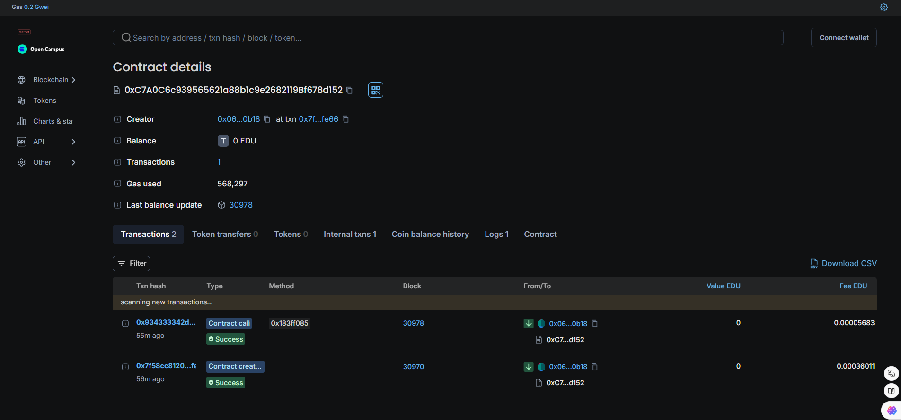

# AttendanceReward Smart Contract

## Vision

The `AttendanceReward` smart contract aims to streamline the process of tracking student attendance and incentivizing participation through a decentralized reward system. By leveraging blockchain technology, this project ensures transparent and immutable records of attendance and rewards, motivating students to maintain consistent attendance. This project aims to develop a blockchain-based system for verifying and rewarding class attendance in educational institutions. The system will leverage the immutability and transparency of blockchain technology to ensure accurate and tamper-proof attendance records while incentivizing students to attend classes regularly through a rewards program.

## Flowchart

Below is the high-level flowchart of the contract's operation:

1. **Student Check-In**:
   - Student calls the `checkIn()` function.
   - Attendance count and reward balance are updated.

2. **Event Emission**:
   - `CheckIn` event is emitted with updated details.

3. **Querying Details**:
   - Use `getStudent(address _studentAddress)` to retrieve attendance count and reward balance.

```
          +-------------------+
          |  Contract Deployed |
          +-------------------+
                   |
                   |
         +-------------------+
         |    checkIn()      |
         +-------------------+
                   |
   +---------------+---------------+
   |                               |
   |   +--------------------+      |
   |   | Increment Attendance |    |
   |   +--------------------+      |
   |              |                |
   |              v                |
   |   +--------------------+      |
   |   | Increase Reward    |      |
   |   +--------------------+      |
   |              |                |
   |              v                |
   |   +--------------------+      |
   |   | Emit CheckIn Event|      |
   |   +--------------------+      |
   |                               |
   +-------------------------------+
                   |
                   |
           +---------------------+
           |   getStudent()      |
           +---------------------+
                   |
                   |
   +---------------+---------------+
   |                               |
   |   +---------------------+     |
   |   | Retrieve Student    |     |
   |   | Details from Mapping|     |
   |   +---------------------+     |
   |                               |
   +-------------------------------+
                   |
                   |
         +-----------------------+
         | Output: Details       |
         | (attendanceCount,     |
         | rewardBalance)        |
         +-----------------------+

```

## Contract Address

   - **Contract Name**: Attendance Reward System
   - **Contract Address**: 0xC7A0C6c939565621a88b1c9e2682119Bf678d152
   - **Network**: Edu_Chain

   

## Future Scope

- **Enhanced Reward System**: Implement varying reward rates based on attendance streaks or milestones.
- **Integration with Decentralized Applications (DApps)**: Allow integration with educational DApps for seamless student and reward management.
- **Automated Notifications**: Develop a system to notify students of their rewards or milestones via blockchain-based messaging.
- **Analytics Dashboard**: Create a dashboard to analyze attendance trends and reward distributions.

## Contact
For further inquiries or support, please reach out to:
- **Email**: shidharthlaishram@gmail.com
- **GitHub**: https://github.com/shwwid
